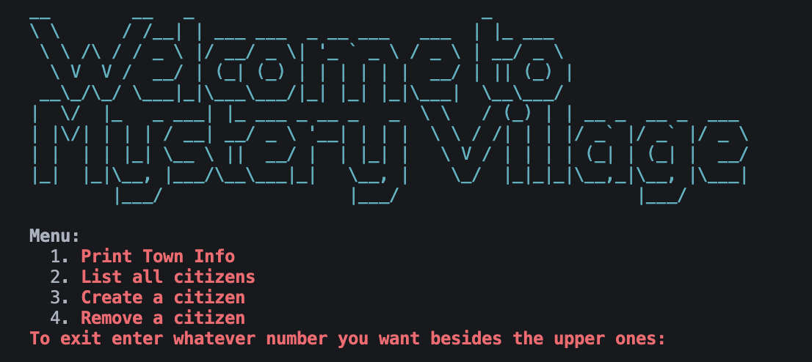
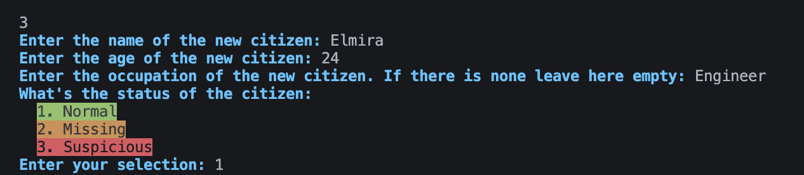
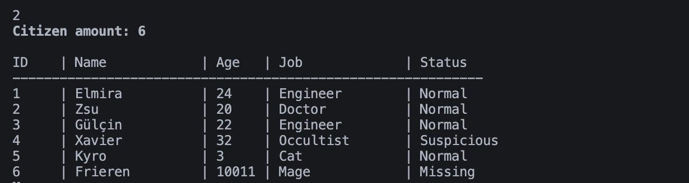
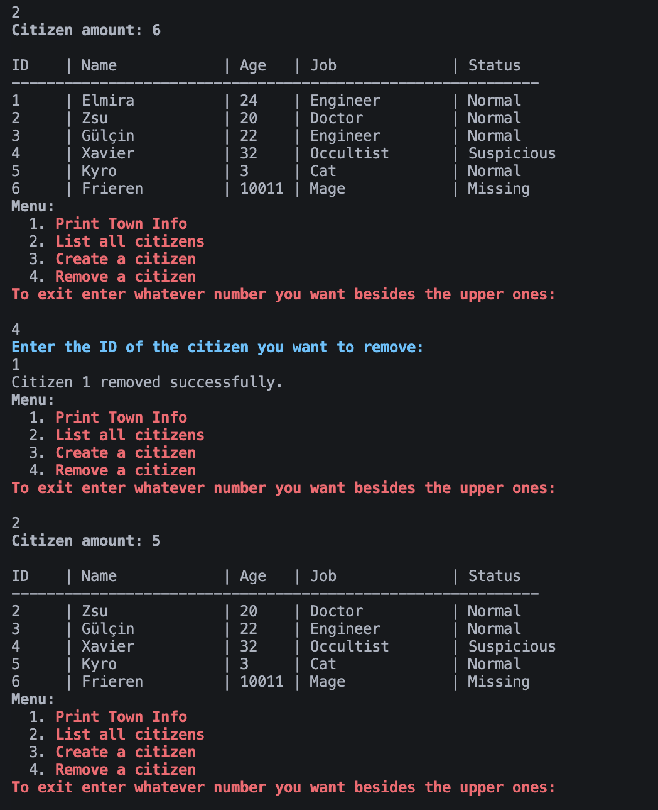
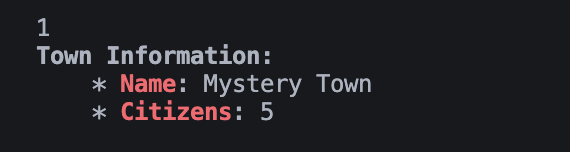

# Mystery Town

Mystery Town is a simple command-line simulation for managing a fictional town and its citizens. The project is written in Python and uses the `colorama` library for colored terminal output.



## Features
- **Add Citizens:** Enter new citizens with name, age, job, and status (Normal, Missing, Suspicious).
- - 
- **List Citizens:** View all citizens in a neatly formatted table.
- - 
- **Remove Citizens:** Remove a citizen by their unique ID.
- - 
- **Town Info:** Display the town's name and current population.
- - 
- **Status Highlighting:** Citizens can be marked as Suspicious automatically if their name contains 'x' or their job is 'Occultist'.

## How It Works
- Citizens are stored as dictionaries in a list within the `town` dictionary.
- The main menu allows you to print town info, list citizens, add a citizen, or remove a citizen.
- The `citizen.py` file contains the `create_citizen` function for creating citizen objects.
- The `main.py` file contains all the main logic and user interaction.

## Requirements
- Python 3.x
- colorama

Install dependencies with:
```sh
pip install colorama
```

## Usage
Run the program with:
```sh
python main.py
```
Follow the on-screen menu to manage your town and its citizens.

## File Structure
- `main.py` — Main program logic and menu
- `citizen.py` — Citizen creation function
- `README.md` — Project documentation

## License
This project is for educational purposes.
